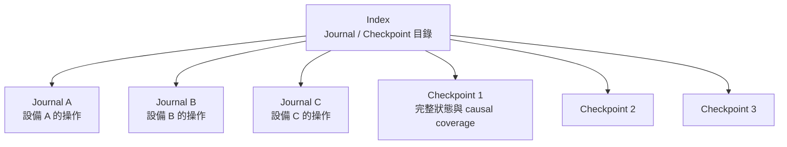
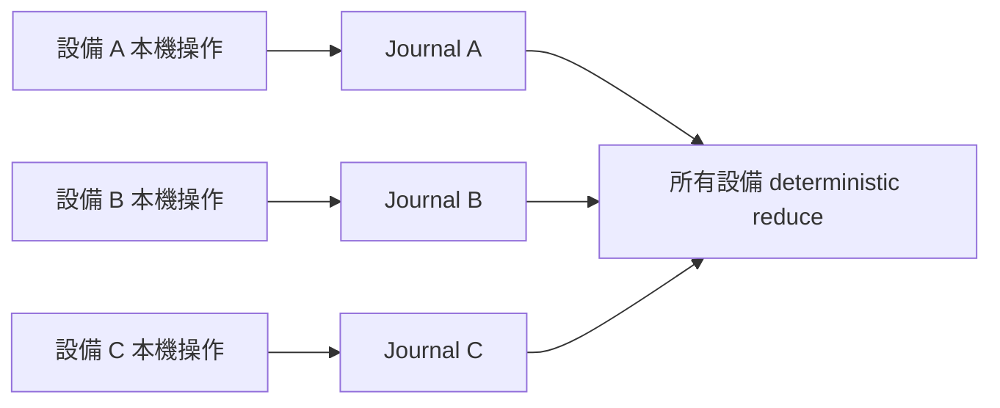
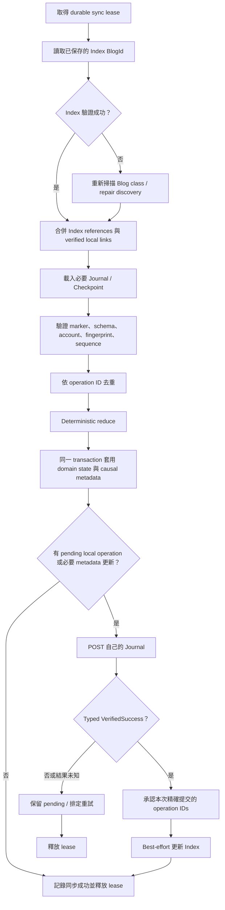
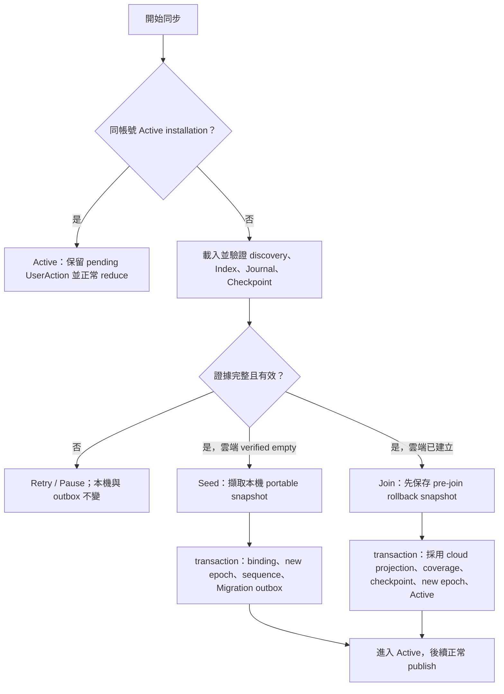
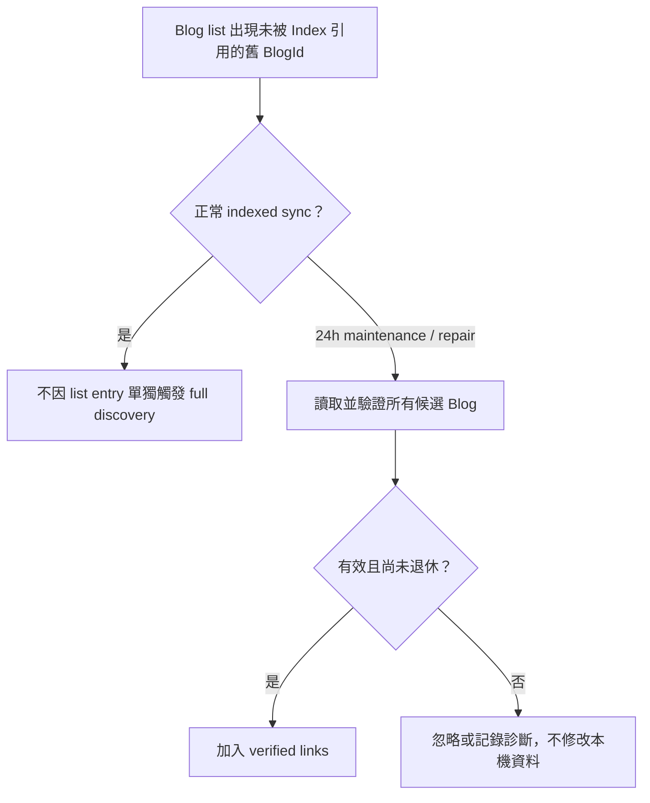
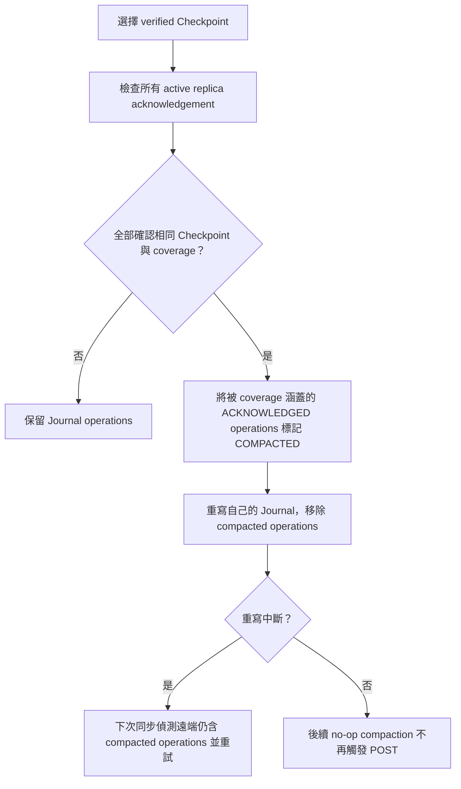
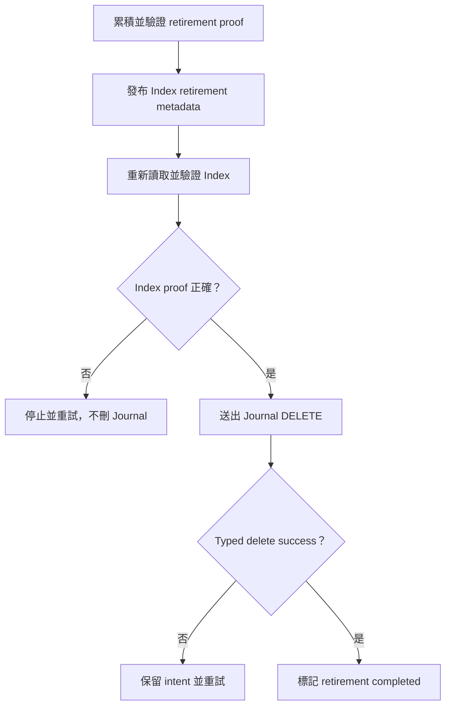

# 雲端同步資料模型與流程

本文說明 Yamibo App 雲端同步使用的三種雲端 Blog：Index、Journal
與 Checkpoint，以及它們在正常同步、Seed、Join、完整探索、壓縮與故障復原時的角色。

## 設計目標

同步系統採用 local-first、operation-log 架構，主要目標如下：

- 本機資料是 App 日常操作的主要來源，網路中斷時仍可使用。
- 每筆可同步變更都有穩定 operation ID，重試不會重複套用。
- 不使用「整份本機資料較新」或「整份雲端資料較新」判斷覆蓋方向。
- 新設備或資料被清空的設備必須先安全下載，不可直接用空資料覆蓋雲端。
- 不同設備分別寫入自己的 Journal，避免共同覆寫同一份操作紀錄。
- Checkpoint 限制操作歷史的長期成長，並保留安全復原基準。
- 雲端載入、解析或驗證失敗時，不得修改或刪除本機設定。

## 正式版 Namespace

正式版使用版本化的 `v1` namespace。Blog title 與 class name 只負責 discovery
與人工辨識；真正的資料身份仍由內容 marker、schema、account binding 與 fingerprint
共同驗證。

| 類型 | 正式版識別名稱 |
|---|---|
| Blog class | `Yamibo App Sync` |
| Config | `Yamibo App Sync Config - DO NOT EDIT - v1` |
| Index | `Yamibo App Sync Index - DO NOT EDIT - v1` |
| Journal | `Yamibo App Sync Journal - DO NOT EDIT - v1 - <replica>` |
| Checkpoint | `Yamibo App Sync Checkpoint - DO NOT EDIT - v1 - <checkpoint>` |

開發期間使用的 `ymb-sync-9f4c2a7` namespace 不會被正式版自動採用，也不會被
正式版的同步資料清理流程當成 `v1` 資料刪除。若未來需要匯入舊資料，必須另行提供
明確且經驗證的 migration 流程。

## 雲端 Blog 組成

| 類型 | 主要用途 | 一般數量 | 是否為資料真相 |
|---|---|---:|---|
| Index | 記錄 Journal、Checkpoint 的位置與 fingerprint | 1 | 否，僅為 advisory discovery cache |
| Journal | 記錄單一 replica/device 產生的增量操作 | 每個 active replica 1 | 是，操作紀錄來源 |
| Checkpoint | 保存特定 causal coverage 下的完整狀態 | 最多 3 | 是，經驗證的復原與 compaction 基準 |



## Index

### 用途

Index 是雲端同步資料的目錄。它讓 App 在已知 BlogId 的情況下直接讀取必要資料，
不必在每次同步時掃描整個 Yamibo Blog class。

Index 主要包含：

- account binding。
- 每個 replica 對應的 Journal BlogId。
- Journal fingerprint。
- Checkpoint ID、BlogId 與 fingerprint。
- 已退休 Journal 的 metadata。
- Index 更新時間。

概念範例：

```text
device-A:epoch-1 -> journal blog 117756
device-B:epoch-3 -> journal blog 117760

checkpoint-1 -> blog 117750
checkpoint-2 -> blog 117752
checkpoint-3 -> blog 117753
```

### Advisory 原則

Index 是 discovery cache，不是刪除或資料存在性的唯一證據。

- Index 遺漏某篇已知 Journal，不代表該 Journal 已刪除。
- 不可只因 Index 沒有某個 replica 就刪除它的操作。
- Index reference 會覆蓋本機同 replica/checkpoint 的舊 BlogId。
- Index 未列出的既有 verified local link 仍會保留。
- 新但尚未被本機或 Index 知道的 Journal，由 24 小時完整探索找回。

這項限制是必要的，因為 Index 本身是 shared whole-document write。兩台設備同時更新
Index 時，後寫入者可能基於較舊版本送出內容，使另一台設備剛加入的 reference 暫時遺失。

### 正常讀取

如果本機已保存 verified Index BlogId：

1. 直接讀取該 Index。
2. 驗證 title、marker、schema、account binding 與 fingerprint。
3. 將 Index references 與本機已驗證 links 合併。
4. 只讀取 fingerprint 改變或尚無記憶體 payload cache 的 Journal/Checkpoint。

正常情況不需要先抓 Blog class page。

### Index 失效

以下情況才重新掃描 Blog class：

- 尚未保存 Index BlogId。
- Index BlogId 回傳 NotFound。
- Index title、marker、schema、account binding 或 fingerprint 無效。
- Index 引用的必要 BlogId 已失效。
- 使用者清除雲端連結紀錄快取。
- 執行明確 repair。
- 24 小時 maintenance 完整探索到期。

## Journal

### 用途

Journal 是單一 replica 的增量操作紀錄。每台設備只寫自己的 Journal，不會直接修改
其他設備的 Journal。



### Replica identity

一個 replica 由下列 identity 組成：

- device ID。
- device epoch。
- writer nonce。

device epoch 用於區分同一裝置的不同資料世代。資料庫重建、舊備份恢復或 writer
collision 時，系統會建立新 epoch，避免舊安裝與新安裝共同寫入同一 Journal。

### Operation 內容

每筆 operation 至少包含：

- 穩定 operation ID。
- device ID 與 device epoch。
- 單調遞增 sequence。
- account binding。
- domain ID 與 stable entity ID。
- Put、Patch、Delete、RelationAdd 或 RelationRemove 等 operation kind。
- causal context。
- schema version。
- diagnostic timestamp。
- operation origin。

可能的操作範例：

```text
settings/theme          -> Patch(value = dark)
favorite.item/abc       -> Put(...)
favorite.item/xyz       -> Delete
favorite.update/123     -> Patch(read = true)
```

### 同步 domain 與閱讀資料 identity

閱讀相關資料分成獨立 domain，不使用一個混合列表作為同步來源：

| Domain | Stable entity identity | Clear-all 是否清除 |
|---|---|---|
| `reading.thread` | thread type、ThreadId、author identity | 是 |
| `reading.image` | PostId | 是 |
| `reading.tag-manga` | 全域 TagId | 是 |
| `reading.tag-catalog` | 全域 TagId | 是 |
| `reading.rss-search` | parent RSS subscription canonical sync ID | 是 |
| `reading.rss-catalog` | parent RSS subscription canonical sync ID | 是 |
| `reading.time` | date key | 否 |

Tag Manga 與 Tag catalog 即使使用相同 TagId，也因 domain 不同而是不同 entity。RSS
history 不得把 device-local subscription database ID 寫入雲端；Android 與 iOS repository
會先由 subscription 的 query/forum identity 解析 canonical sync ID。舊 RSS history 若找不到
parent subscription，保留在本機但不產生 Seed migration operation，避免污染其他設備；
bootstrap 結果會回報略過筆數，雲端同步狀態以 i18n 明文提示使用者。

Tag catalog、RSS search 與 RSS catalog 都包含於 local backup 與 AppSync portable snapshot；
下載檔案、頁面 cache、chapter cache/state 等 device-local 資料仍不進 AppSync。

### Journal metadata

Journal 除了 operations，也保存：

- observed causal vector。
- 已確認的 Checkpoint 與 coverage。
- heartbeat。
- published-through sequence。

這些 metadata 用於判斷設備活躍狀態、Checkpoint acknowledgement，以及 Journal
是否可安全退休。

### Causal coverage 不變量

本機持久化的 causal watermark 必須涵蓋目前 resolved state 引用的每一筆 operation，
包括 field winner、relation operation 與 tombstone。使用者已在本機看見或採用的 winner，
不得因 Checkpoint coverage 缺漏而在下一次本機修改時被誤判為 concurrent operation。

因此系統會在兩個時機補齊 coverage：

- 每次保存 reduction metadata 時，從 resolved entities 引用的 operation 推進 watermark。
- AppSync 啟動時，重新掃描持久化的 resolved state 並修復舊資料缺少的 watermark。

例如裝置 B 已採用裝置 A 的 `settings/theme = SYSTEM`，即使舊 Checkpoint 漏記 A 的
sequence，B 後續改成 `DARK` 時仍必須帶上涵蓋該 winner 的 causal context。其他裝置
reduce 時會把 `DARK` 判定為明確較新的修改，而不是用 operation ID tie-break 處理一場
不存在的並行衝突。

### Single-writer 原則

正常情況下一篇 Journal 只有一個 writer。同步前會驗證：

- Journal replica identity 是否符合目前安裝。
- writer nonce 是否一致。
- 本次 initial pull 的 fingerprint 是否仍是呼叫端預期版本。

若同一 device epoch 出現不同 writer nonce，系統不會覆寫該 Journal，而會要求
rebootstrap 或輪替到新 epoch。

## Checkpoint

### 用途

Journal 不可能永久保留所有歷史操作。Checkpoint 將特定 causal coverage 下的完整
同步狀態保存成不可變 Blog，讓新設備與長期未上線設備不必重播全部歷史。

Checkpoint 包含：

- Checkpoint ID。
- account binding。
- `BackupModels` 完整資料投影。
- resolved entities。
- tombstones。
- causal coverage vector。
- 建立時間。
- schema 與 fingerprint。

概念範例：

```text
Checkpoint cp-123 covers:
device-A:epoch-1 -> sequence 120
device-B:epoch-3 -> sequence 87
device-C:epoch-2 -> sequence 42
```

### 不可變性

Checkpoint 建立後不在原 Blog 上持續更新。新狀態會建立新的 Checkpoint ID 與 Blog。
這可避免兩台設備同時更新同一份完整快照時互相覆蓋。

### 保留上限

一般最多保留 3 篇 Checkpoint。超過上限時刪除較舊且未被固定的 Checkpoint。

以下 Checkpoint 不可直接刪除：

- Journal retirement proof 仍依賴的 Checkpoint。
- 尚未完成 active replica acknowledgement 的復原基準。
- 刪除後會使未 compacted operations 失去安全基準的 Checkpoint。

如果安全限制使數量暫時超過 3，系統應回報 storage pressure，而不是破壞復原能力。

## 正常同步流程



### POST 成功條件

一般 Journal、Checkpoint 與 Index write 不會 GET 剛 POST 的 reader page。

只有以下情況可視為成功：

- Yamibo response parser 回傳 typed `VerifiedSuccess`。
- 更新既有 Blog 時，目標 BlogId 已知。
- 建立新 Blog 時，response 恰好解析出一個 BlogId。

普通 HTTP 200、timeout、無法解析的成功頁或不明確 BlogId 都不能承認操作成功。
結果未知時，operation 保持 pending 或 published-unverified，下一次同步會先正常 pull
再決定是否重試。

### Concurrent remote write

另一台設備可能在本次 initial pull 後送出新操作。因 Yamibo 不提供 ETag/CAS，
額外立即 full pull 仍不能保證全域瞬時一致。

因此正常同步不執行無條件第二輪 full pull。晚到的 remote operation 由下一次
scheduled、lifecycle 或 manual sync 吸收。

## Bootstrap：Seed、Join 與 Active



### Seed

只有在 discovery 與所有必要 page 均成功解析、驗證，且沒有有效 Checkpoint 或 Journal
operation 時，才視為 verified empty。Seed 此時才擷取本機 snapshot，將既有設定、收藏、
更新紀錄及支援的閱讀資料轉成 origin=`Migration` 的 durable operations。binding、replica
identity、sequence allocation 與 migration outbox 在同一 transaction 完成；中斷後重用
既有 operations，不重新產生相同 migration。

### Join

只要有一個有效 Checkpoint 或 validated Journal operation，新的、重設的或需要 rebootstrap
的 installation 走 Join。Join 以雲端為 authoritative：本機 legacy 值不做 semantic overlap
比較、不進 outbox，也不覆蓋雲端。系統先將完整 pre-join portable snapshot 壓縮保存到
`AppSyncBootstrapRollback`，附帶 account binding、database generation 與建立時間；再以單一
transaction 採用 cloud projection、causal coverage、checkpoint metadata、新 replica epoch
與 `Active` state。

若 materialization 或 transaction 失敗，projection、causal metadata、outbox lifecycle 與
installation identity 一起 rollback。已保存的 rollback snapshot供診斷與未來復原使用，
目前沒有使用者操作 UI。

### Active

同帳號、同 database generation 的 Active installation 不再執行 legacy admission 比較。
pending `UserAction` operations 保留並與 cloud operations 進 deterministic reducer。兩台設備
同時修改同一設定時，只解析該 entity 的確定性 winner，不得因此隔離整個 installation 或
停止其他 module。

關鍵限制：

- admission 決策完成前不得建立或上傳 migration operations。
- 雲端載入失敗不得清除、覆蓋或刪除本機設定。
- 幾乎空白的新設備不得被視為「最新完整狀態」。
- Join 的 legacy local data 只能進 rollback snapshot，不能轉成 migration operations。
- Force Pull 或 Force Push 成功時，資料 transaction 與 durable `Active` transition 必須一致。

## 閱讀歷史刪除與重建

所有 public save/delete mutation 由 recording repository 擁有；遠端 materialization 直接使用
non-recording SQL/repository path，避免收到 operation 後又產生新的 local operation。

- 單筆與選擇刪除依具體 subtype 產生該 domain 的 Delete tombstone。
- Clear-all 直接完整讀取六張同步 history backing tables，再取得 bulk-delete authorization。
- Delete operations 與六張 history table 的本機刪除在同一 transaction commit。
- 任一枚舉、RSS identity 解析、authorization 或 transaction 失敗時，不清任何 history，
  也不留下部分 outbox。
- Clear-all 不清除 `reading.time` 閱讀時間統計。
- 已觀察 tombstone 後再次閱讀同一目標，會用更高 entity generation 建立 Put；舊 tombstone
  不會讓該項目永久無法同步。
- concurrent delete 與舊 generation progress update 採 remove-wins；明確的後續新 generation
  read 才能重建。

## 完整探索與 Yamibo 刪除延遲

Yamibo 存在刪除後 list page 或 reader page 暫時仍可取得舊 Blog 的情況。因此：

- DELETE 成功以 typed delete response 為準，不等待 post-delete GET 變成 NotFound。
- 正常同步不可因 stale deleted list entry 不在 Index 中，就判定 Index 無效。
- 正常同步不會掃描列表中的每一篇舊同步 Blog。
- 已驗證 Index 與 local links 是快速路徑。
- 24 小時 maintenance 仍會執行完整探索，以找回真正遺漏的新 Journal。



## Checkpoint compaction



Compaction 只有以下情況會要求 Journal publication：

- 有新的 acknowledged operation 被 Checkpoint coverage 涵蓋。
- 先前 rewrite 中斷，遠端 Journal 仍包含已標記 compacted 的 operation。

沒有新工作時不得因既有 Checkpoint 無條件 POST Journal 與 Index。

## Journal retirement

Journal retirement 用於清理由長期不活躍 replica 留下的 Journal。它比一般
Checkpoint retention 更嚴格。

退休前必須證明：

- Checkpoint 已涵蓋該 Journal 的 published-through sequence。
- 所有 active replicas 已確認該 Checkpoint。
- replica 超過 90 天沒有 heartbeat。
- observation 與 proof 未改變。

破壞性 retirement 流程仍保留 Index reload verification：



一般同步的 POST success 最佳化不會放寬 retirement 的破壞性 proof。

## 錯誤處理

| 錯誤 | 行為 |
|---|---|
| 未登入 / FormHash 過期 | 暫停同步，提示使用者重新整理登入狀態 |
| Yamibo maintenance | 顯示「Yamibo 正在維護，將稍後自動重試」 |
| Network / timeout | 保留 pending operations，排定重試 |
| Journal load/publish terminal provider failure | 保留 pending operations，持久化 `PausedProvider`；不得回報 `Quarantined` |
| Index 無效 | 不修改本機資料，重新探索 verified links |
| 單一 Journal 毀損 | 隔離該版本，其他有效 Journal 繼續處理 |
| Unsupported schema | 暫停受影響路徑並顯示詳細原因 |
| Writer nonce collision | 不覆寫 Journal，要求 rebootstrap / 新 epoch |
| Checkpoint storage pressure | 停止不安全刪除，不丟棄未被覆蓋操作 |
| Valid concurrent entity conflict | deterministic reduce；不得進 installation-wide quarantine |
| Invalid operation/schema/sequence invariant | 進入 Quarantined，停止一般同步並等待人工復原 |

任何 cloud load、parse 或 validation failure 都不得：

- 清空本機同步 scope。
- 將空白資料視為 authoritative。
- 刪除本機設定。
- 自動 force push。
- 自動 force pull。

### Quarantined 邊界

`Quarantined` 只保留給 malformed operation、無法成立的 replica/sequence/identity invariant，
或已驗證 payload 的結構性毀損。`refresh`、立即同步與背景排程遇到此狀態都不 pull、apply
或 publish。它不會自動選擇 Force Pull/Push。

背景任務若由其他狀態首次進入 durable `Quarantined`，Android 會發出高重要性系統通知；
iOS 在使用者已授權通知時發出本機通知。既有 `Quarantined` 的重複排程不會重複提醒。
通知只使用可翻譯的使用者文案，詳細隔離原因保留在雲端同步頁面。

使用者可另外開啟 Force preview，重新 authoritative load 並查看本機/雲端差異；只有完成
倒數與二次確認後才執行 Force Pull 或 Force Push。preview token 若因本機或雲端在確認前
變更會失效。成功資料 transition 與 durable `Active` state 一起保存；失敗仍維持隔離。

Force preview 與確認只用於顯示破壞範圍及避免誤觸，不參與資料勝負判斷。Force Push
直接以確認當下的本機資料庫 snapshot 覆蓋雲端 projection；本機不存在的項目會成為明確
刪除。Force Pull 直接以重新載入的雲端 projection 覆蓋本機 scope。兩條路徑都不執行
local projection audit/repair，也不套用一般同步的 merge policy；Force Pull 前的 rollback
snapshot 僅供失敗復原。

## Request 成本

在同一 App 程序、Index 與 payload cache 有效且沒有本機變更時：

```text
GET cached Index = 1 request
POST = 0
```

有本機變更時通常為：

```text
GET cached Index = 1
POST own Journal = 1
POST Index = 1
總計約 3 requests
```

App 程序剛重啟時，記憶體 payload cache 尚未建立，除了 Index 外還需要讀取 Index
引用且本機沒有 payload 的 Journal/Checkpoint。這不是完整掃描，且不會讀取 stale
deleted list entries。

完整 `class page + all candidate blogs` 只應出現在：

- 首次 discovery。
- Index 或必要 cached identity 失效。
- 清除連結快取或 repair。
- 24 小時 maintenance。

## 核心不變量

1. Index 只加速 discovery，不單獨證明資料已刪除。
2. 每個 replica 只寫自己的 Journal。
3. Operation ID 去重與 domain apply 必須在一致的 transaction 邊界內。
4. Checkpoint 沒有完整 acknowledgement 前，不得 prune operation。
5. 雲端讀取失敗時，不得修改或刪除本機設定。
6. 新設備完成 verified Seed/Join admission 前，不得 publish。
7. DELETE 成功不依賴 Yamibo reader 立即 NotFound。
8. 一般同步不執行無條件 full discovery 或 pull-again。
9. No-op compaction 不得觸發 Journal/Index POST。
10. Force push、force pull 與清除雲端資料只能由使用者明確確認。
11. Join 不得發布 joining device 的 legacy local state，且套用前必須保存 rollback snapshot。
12. Clear-all 閱讀歷史必須產生六種 history tombstones，但不得清除閱讀時間統計。
13. 無法解析 stable parent 的舊 RSS history 保留本機且不得使用 local ID 上傳。
14. Quarantined 阻止一般前景與背景同步；合法並行值衝突不得觸發 Quarantined。

## 目前驗證範圍與限制

本輪變更已由自動化測試驗證：

- verified-empty Seed、established-cloud divergent Join、Active pending operation 與 cloud load
  failure 路徑。
- Join 不產生 legacy migration operation，rollback snapshot 可跨 store restart 讀回。
- Force Pull/Push 從 Quarantined 成功後 durable state 為 Active。
- Android production recording repository 對六種 history 的新增、選擇刪除、clear-all、
  delete/recreate generation 與失敗前不變性。
- 兩個獨立 SQLDelight database 的 A/B 等價 integration；RSS local subscription ID 不同時仍
  依 canonical sync ID materialize 並在刪除後收斂。
- AppSync snapshot inclusion、change-summary 顯示、SQLDelight migration、Compose cloud-sync
  state test，以及 shared/Compose iOS simulator compilation。

這些測試證明 deterministic 行為與 transaction invariant，但不等同真實 Yamibo 網路的
長期 rollout 指標。尚未取得大量實際設備下的成功率、request count、網站 eventual
consistency retry 與 90 天 retirement telemetry，因此不得以此文件宣稱已達成 99% 或
99.99% 的 production reliability。舊 reader/rollback compatibility 也不得在 rollout
證據完成前移除。
